# Lab Report 1

## Changing Your Password
1. Go to the link https://sdacs.ucsd.edu/~icc/index.php
2. Enter your username and PID. 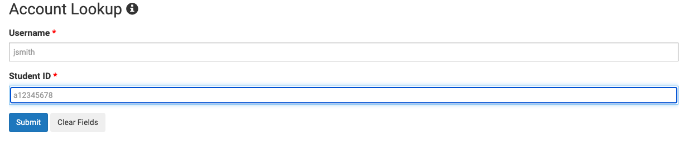
3. Click the button under the header "Additional Accounts" 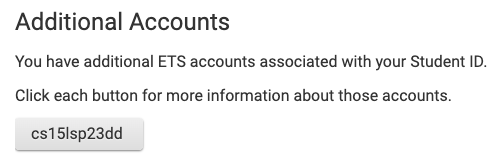
5. Click on the "Global Password Change Tool" link in the orange box 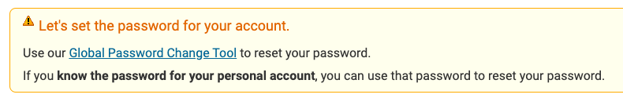
6. Click on the "Proceed to the Password Change Tool" under the header "Student, AX, or Course-Specific Student Accounts" 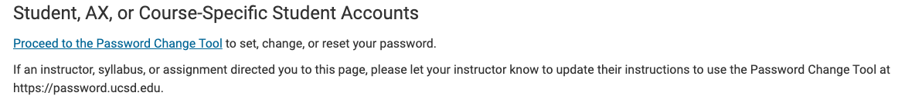
7. Enter your CSE 15L username (text on the button you first cliekced) 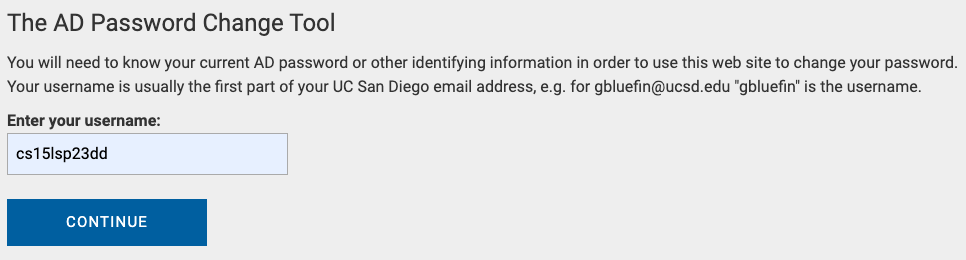
8. Click on the "I want to reset my course-specific account password." link 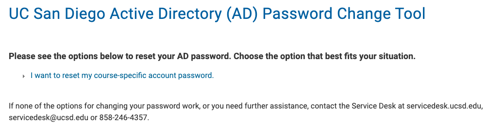
9. Do the Duo Multi-Factor Authentication
10. Click on the "YES" button when prompted to confirm your email 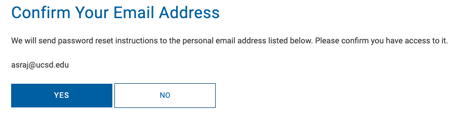
11. Go to your email and go to the "Password Reset" email. 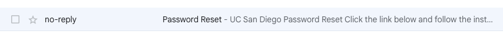 Click on the "UC San Diego Password reset page" link within the email 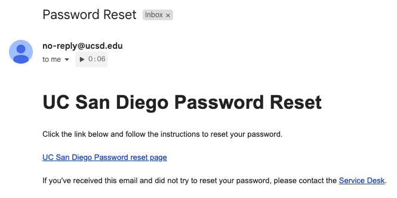
12. Enter your new password, confirm the password by entering it again, then click the "Change Password" button. 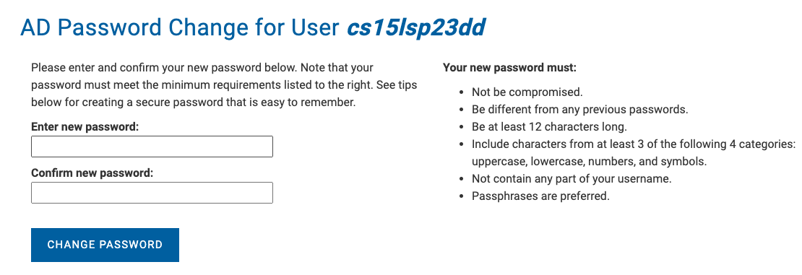

## Installing VScode

Note: I did not need to do these steps because my computer already had VScode downloaded

1. In order to download VScode, you first need to go the the Visual Studio Code website (https://code.visualstudio.com/) 
2. Complete the instructions on the website to download it to your computer. 
3. Cick on the button in the top right that says "download". 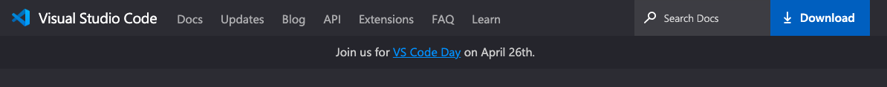
4. Download the version that applies to your computer. 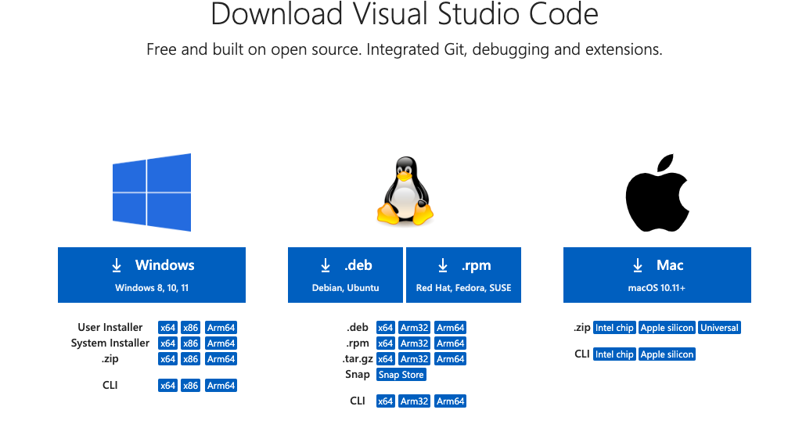
5. Open the downloaded file. You should now be able to use VScode. 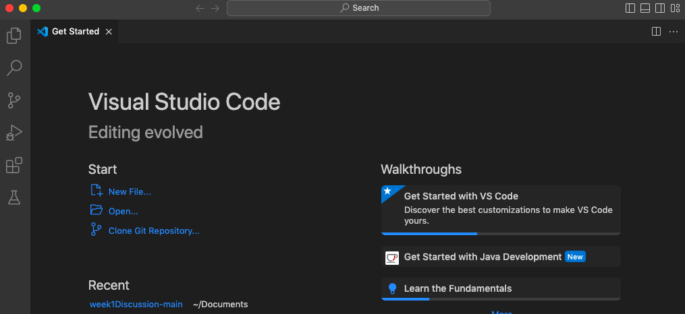

## Remotely Connecting

1. Open the terminal in VScode. This can be done by opening VScode and going to "view" in the top left corner of your Mac. Then, click "view" and you should be able to open the terminal.

2. Type in the command ssh cs15lsp23dd@ieng6.ucsd.edu. However, you will have to replace "dd" with the letters in your course-specific account. I typed in the command ssh cs15lsp23dd@ieng6.ucsd.edu because the letters in my course-specific account were "dd".  As you can see in the screenshot, under the heading "Additional Accounts", the letters for my course-specific account were the letters where the dashes are in "cs15lsp23--" on the button text. 

3. You may get the message The authenticity of host 'ieng6.ucsd.edu (128.54.70.227)' can't be established.
RSA key fingerprint is SHA256:ksruYwhnYH+sySHnHAtLUHngrPEyZTDl/1x99wUQcec.
Are you sure you want to continue connecting (yes/no/[fingerprint])? .  If this occurs, type in "yes" into the terminal.

4. You will then be prompted to enter your password. If you get an error message, make sure you wait 15-60 minutes after changing your CSE15L account password before trying again. When I attempted to do this, I got the following error message  I waited around 20 minutes before trying again, and then everything worked as it was supposed to.

5. Once you enter your password, you will get this 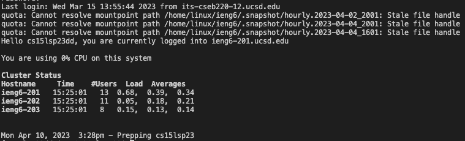 You are done!

## Trying Some Commands

1. Using the terminal in VScode, run the following commands: cd, ls, pwd, mkdir, and cp. Try various combinations of these commands, noting when they work and when you get an error. I ran all these commands.
* cd 
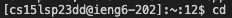
* ls
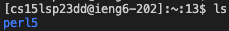
* pwd
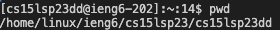
* mkdir
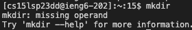
* cp
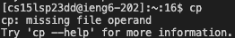

I also ran the following combinations. For some of the commands I didn't get any ouputs and for some I got errors.
* cd and cp
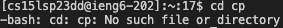
* pwd and ls
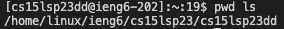
* mkdir and pwd
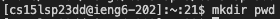

2. Run the following commands and note the output. 
* cd ~
* ls -lat
* ls -a
* ls <directory> where <directory> is /home/linux/ieng6/cs15lsp23/cs15lsp23abc, where the "abc" is a group members’ username
* cp /home/linux/ieng6/cs15lsp23/public/hello.txt ~/
* cat /home/linux/ieng6/cs15lsp23/public/hello.txt

3. I ran all these commands and the following is what I got.
* cd ~
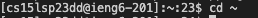
* ls -lat
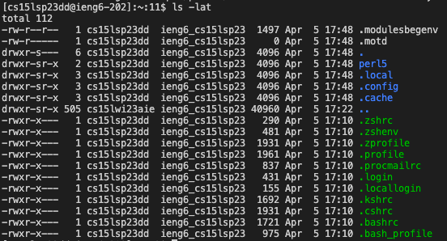
* ls -a
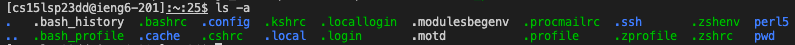
* ls <directory> where <directory> is /home/linux/ieng6/cs15lsp23/cs15lsp23abc, where the "abc" is a group members’ username
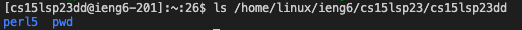
* cp /home/linux/ieng6/cs15lsp23/public/hello.txt ~/
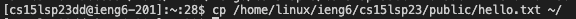
* cat /home/linux/ieng6/cs15lsp23/public/hello.txt
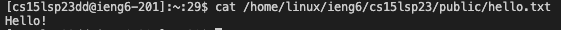
